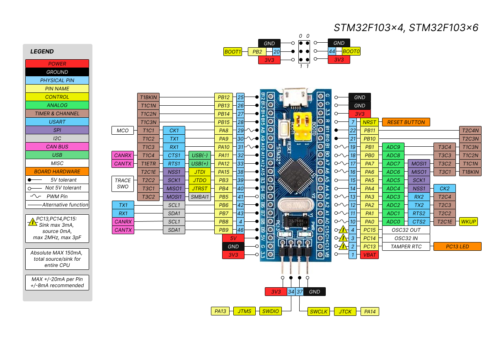

### Meta
Pinagem de versão genérica do Bluepill, com ajustes, quando montado com variaçoes com Sufixo -**x6t6** ou abaixo,   (ex *STM32F103C6T6**) que tem menos recursos.  Os esquemas disponiveis fequentemente  tratam da versão Sufixo -**x8t6** e acima... 

Erratas comuns

Pin41 - PB5 - SMBAI1 - MOSI1 -**T3C2**   (muitos trazem T2C2 nesse pino)    

### Referência
- (ST)[https://www.st.com/en/microcontrollers-microprocessors/stm32f103c6.html]
- (Referencia visual)[http://land-boards.com/blwiki/index.php?title=STM32_Blue_Pill]
